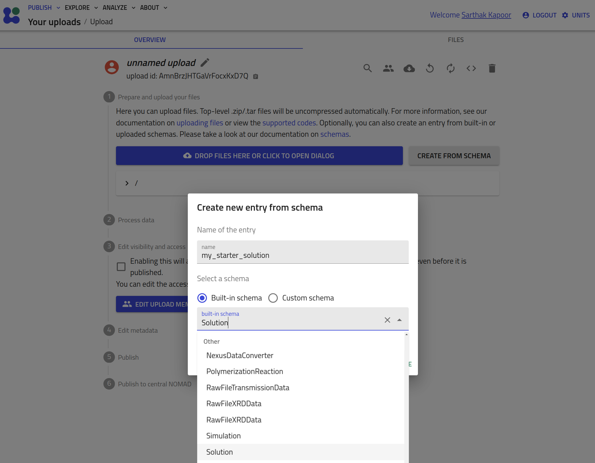
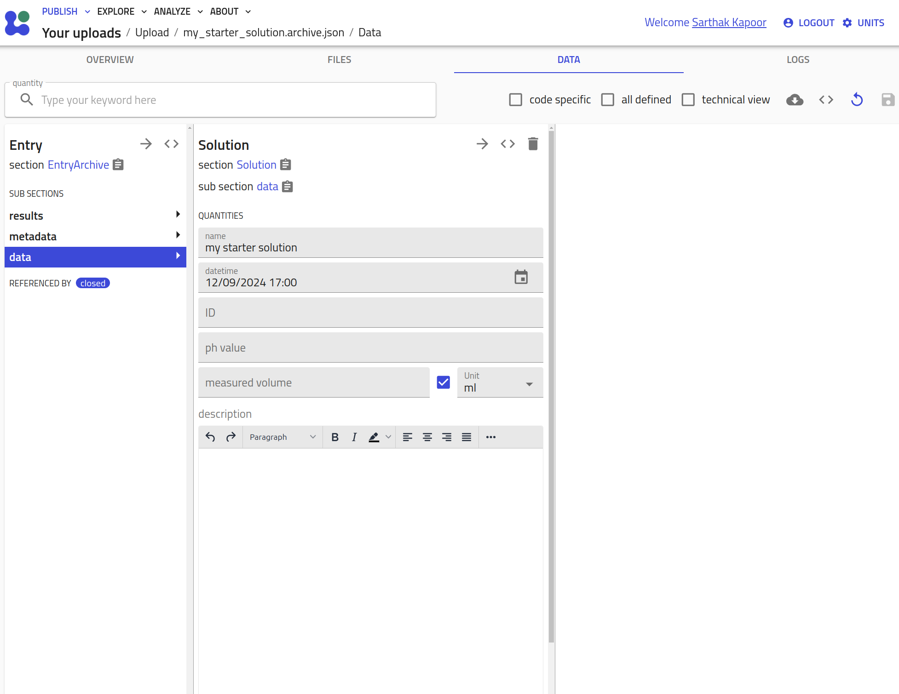

# How to Use the NOMAD-material-processing Plugin

The **NOMAD-material-processing plugin** provides standardized schemas for common methods, processes, and instruments. These schemas are generalized to ensure they are not tied to any specific lab or setup, promoting interoperability across the materials science community. Users can inherit from these schemas, further specializing them to fit their specific needs, all while maintaining a consistent structure that benefits broader community use. For more details, see [levels of schemas in NOMAD](../explanation/levelsofschema.md).

To use this plugin, you must have it installed on your NOMAD Oasis instance (please refer to the [installation guide](install.md) for instructions). Alternatively, you can explore the plugin’s functionality and make use of it on our centrally hosted [Example Oasis](https://nomad-lab.eu/prod/v1/oasis/gui/search/entries).

This guide will walk you through the different ways to use the NOMAD-material-processing plugin:

- **Without specialization**: Instantiating NOMAD entries directly from the "*built-in schemas*".
- **Inheriting and specializing**: Using custom YAML schemas to adapt the existing schemas for your specific use case.
- **Using Python schema plugins**: Inheriting and specializing schemas with Python for advanced customization.

## Using "Built-in Schemas"

In this section, we will demonstrate how to use the standard, built-in **entry** schemas
provided by the plugin without any specialization. These schemas can be directly
instantiated to create entries in a NOMAD Oasis.

1. Start a new upload and click on the **CREATE FROM SCHEMA** button.
2. Select the schema from the drop-down menu, add the name for the entry, and
hit **CREATE**.

    

    

## Inheriting and Specializing Using Custom YAML Schemas

Here, we will guide you through how to extend and specialize the built-in schemas using custom YAML schemas. This approach allows you to tailor the schema to your specific requirements while still leveraging the standardized base sections provided by the plugin.

The schemas found in the plugin are general base sections and they go more and more specific in several techniques, however, they can be limiting in case of your own requirements.

Therefore, NOMAD provides a way of adding technique-specific behavior to the ELNs: YAML schemas - a config file containing schemas added to an NOMAD upload.

Using a `SolutionPreparation` example, we show how to specialize a class with a YAML schema.
Two quantities, namely `initial_temperature` and `final_temperature` are added to `AddSolutionComponent` class, and `SolutionPreparation` is customized with this new class in the `steps` [subsection](../reference/references.md#subsection).
We use a custom YAML schema to define the following sections:

- `SolutionPreparation`
- `AddSolutionComponent`

This leads to a specialization of the initial class:

```yaml
definitions:
  name: 'Solution customization'
  sections:
    MyAddSolutionComponent:
      m_annotations:
        eln:
          properties:
            order:
              - 'name'
              - 'start_time'
              - 'duration'
              - 'comment'
              - 'solution_component'
      base_sections:
        - nomad_material_processing.solution.general.AddSolutionComponent
      quantities:
        initial_temperature:
          type: np.float64
          unit: celsius
          description: "initial temperature set for ramp"
          m_annotations:
            eln:
              component: NumberEditQuantity
              defaultDisplayUnit: celsius
        final_temperature:
          type: np.float64
          unit: celsius
          description: "final temperature set for ramp"
          m_annotations:
            eln:
              component: NumberEditQuantity
              defaultDisplayUnit: celsius
    MySolutionPreparation:
      base_sections:
        - nomad_material_processing.solution.general.Solution
        - nomad.datamodel.data.EntryData
      sub_sections:
        steps:
          repeats: True
          section: '#/MyAddSolutionComponent'
```

You can learn in detail how to create your own YAML schemas in our previous [tutorial 8](https://youtu.be/5VXGZNlz9rc?feature=shared) and [tutorial 13](https://github.com/FAIRmat-NFDI/AreaA-Examples/tree/main/tutorial13/part2).
You can navigate in the [tutorial 8](https://github.com/FAIRmat-NFDI/AreaA-Examples/tree/main/tutorial8) repository
to see some other examples of YAML schemas that inherit and extend existing classes.

## Inheriting and Specializing Using Python Schema Plugins

The most customizable way of using the sections defined in the `nomad-material-processing`
plugin is to extend the sections in another NOMAD schema plugin.

For a detailed tutorial on how to setup and develop a plugin we refer you to the
tutorial on [Developing a NOMAD Plugin](https://nomad-lab.eu/prod/v1/staging/docs/tutorial/develop_plugin.html).

Once your plugin is setup you can include the required `nomad-material-processing` version
as a dependency in your `pyproject.toml`:
```toml
dependencies = [
    "nomad-material-processing>=1.0.0",
]
```

In your schema packages you can then import the desired section definitions and specialize
them to your need by adding any additional quantities or [subsections](../reference/references.md#subsection) that you require:
```py
from nomad_material_processing.vapor_deposition.pvd.thermal import (
    ThermalEvaporation,
    ThermalEvaporationStep,
)
from nomad.metainfo import Quantity


class MyThermalEvaporationStep(ThermalEvaporationStep):
    my_additional_quantity = Quantity(
        type=str,
        description='My additional string quantity`
    )


class MyThermalEvaporation(ThermalEvaporation):
    steps = SubSection(
        description="""
        Specialized steps of my thermal evaporation process.
        """,
        section_def=MyThermalEvaporationStep,
        repeats=True,
    )
```

By using existing [subsection](../reference/references.md#subsection) names (see `steps` in the example above) you can specialize
the [subsections](../reference/references.md#subsection). Please keep in mind that the specialized [subsection](../reference/references.md#subsection) should always
inherit the original one. In the example above the `step` [subsection](../reference/references.md#subsection) used to be of type
`ThermalEvaporation` but we specialized it to `MyThermalEvaporation` step but made sure
that this section inherits `ThermalEvaporation`. By doing this we ensure the
[polymorphism](https://en.wikipedia.org/wiki/Polymorphism_(computer_science)) and that we
will always find steps of (sub)type `ThermalEvaporationStep` in a `ThermalEvaporation`.